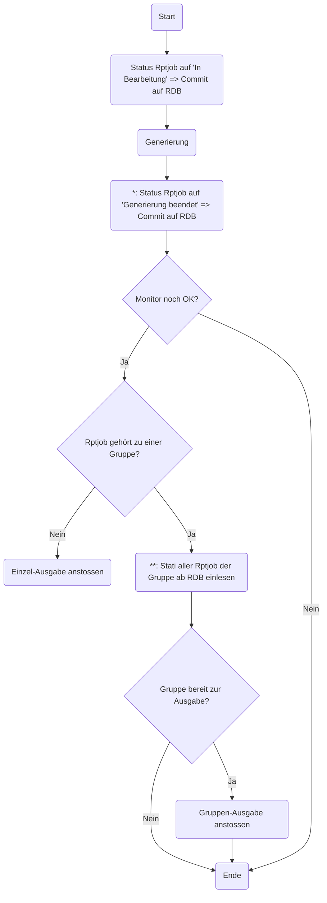
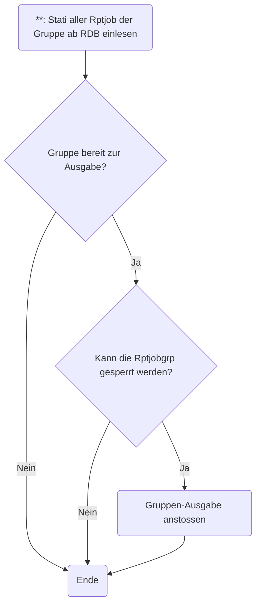

## Ausgangslage

TEC-3655 "B4LCH - Monitoring 900 - mehrere Druckjobs von Serviceaufträgen auf Lieferscheindruck auf in Arbeit stehen geblieben"

Bei einigen Report Jobs geht der Status nicht auf `Beendet`, obwohl bis zum Output alles ausgeführt wurde.

## Korrektur für TEC-3655

Unter anderem versuchen wir, die Report Job Events im Cluster zu synchronisieren, so dass sie alle Server erhalten:

Effekt: Der Gruppen-Ausdruck erfolgt 4 Mal, statt nur 1 Mal. (Der Einzel-Ausdruck funktioniert nach wie vor).

TEC-3822 "B4LCH - Rechnungen werden 4 fach gedruckt (pro Server im Cluster)"

## Korrektur für TEC-3822

Die Gruppen-Ausgabe wird direkt auf dem generierenden Server angestossen:

Effekt: Der Gruppen-Ausdruck erfolgt nur noch 1 Mal.

## Zoom auf den Generierungsserver

Da der Update des Generierungsstatus in einem separaten Thread statt findet, kann es sein dass beim Test der Status auf der RDB noch nicht sichtbar ist.

## Weitere Korrektur für TEC-3822

Der Generierungsstatus wird sofort persistiert:

Somit findet der Test für die Gruppenausgabe immer die aktuellsten Stati vor. 

Natürlich muss auch im Fehlerfall korrekt persistiert werden: TEC-3846 "PQ: Generierung bleibt auf in Arbeit bei ReportJobGruppe mit einem Fehlerhaften Reportjob" gab noch eine kleine Ehrenrunde.

## 2-fach Ausdruck, nur im LCH Cluster (TEC-3860)

Leider wurden in der Landi Schweiz Produktion die Rechnungen immer noch *doppelt* ausgedruckt.

Der Generierungsprozess für einen einzelnen Report Job sieht so aus:

Falls es die beiden letzten Rptjob in der Gruppe schaffen, ihren Status 'Generierung beendet' auf die RDB zu committen bevor sie alle Stati wieder einlesen, dann kann die Ausgabe 2 Mal erfolgen.

Die Lösung - vom Kunden bereits bestätigt - ist eine Objektsperre (`Objlck`) auf der Report Job Gruppe. Die RDB stellt sicher, dass nur eine einzige Sperre geschrieben werden kann:

Nach Beendigung der (asynchron erfolgenden) Gruppenausgabe wird die Sperre auf der Report Job Gruppe wieder entfernt.

## Zusammenfassung

 - Durch Anstossen der Ausgabe auf dem generierenden Server (Sender statt Empfänger) verhindern wir mehrfachen Output.
 - Durch sofortiges Persistieren des Generierungsstatus (Sender statt Empfänger) liefern wir den Nachfolgern die korrekte Information.
 - Durch eine Objeksperre auf der Report Job Gruppe stellen wir sicher, dass im Cluster die Gruppe nur 1 Mal augegeben wird 

Alle Korrekturen sind in den folgenden Frame Versionen enthalten:
 - `57.0.0`
 - `56.0.1`
 - `55.0.3`
 - `54.0.3` (TEC-3860 vorbreitet auf 54.0-patch)
 - `53.0.3`

Wir sind zuversichtlich, dass diese Korrekturen auch zu einer Verbesserung des ursprünglichen Problems beitragen.
Dies muss in der Produktion jedoch noch bestätigt werden.

