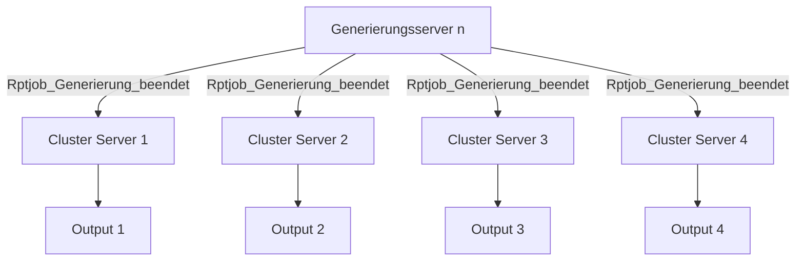

## Ausgangslage

Bei einigen Report Jobs geht der Status nicht auf `Beendet`, obwohl bis zum Output alles ausgeführt wurde.

## Korrektur 1

Unter anderem versuchen wir, die Report Job Events im Cluster zu synchronisieren, so dass sie alle Server erhalten.

Effekt: Ausdruck erfolgt 4 Mal, statt nur 1 Mal.
