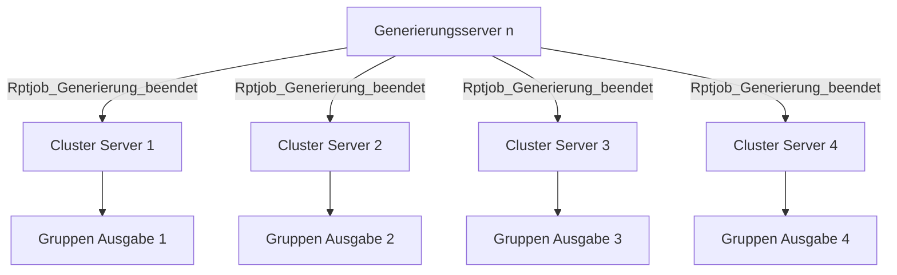
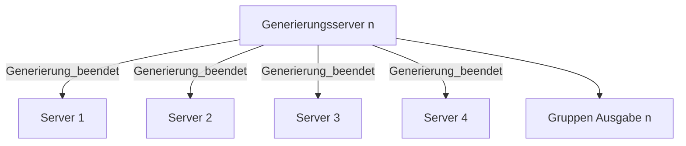
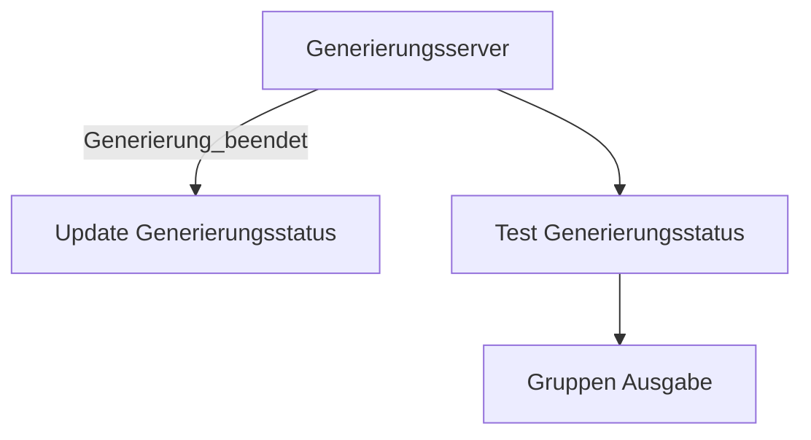

## Ausgangslage

Bei einigen Report Jobs geht der Status nicht auf `Beendet`, obwohl bis zum Output alles ausgeführt wurde.

## Korrektur 1

Unter anderem versuchen wir, die Report Job Events im Cluster zu synchronisieren, so dass sie alle Server erhalten:

Effekt: Der Gruppen-Ausdruck erfolgt 4 Mal, statt nur 1 Mal. (Der Einzel-Ausdruck funktioniert nach wie vor).

## Korrektur 2

Die Gruppen-Ausgabe wird direkt auf dem generierenden Server angestossen:

Effekt: Der Gruppen-Ausdruck erfolgt nur noch 1 Mal.

## Zoom auf den Generierungsserver

